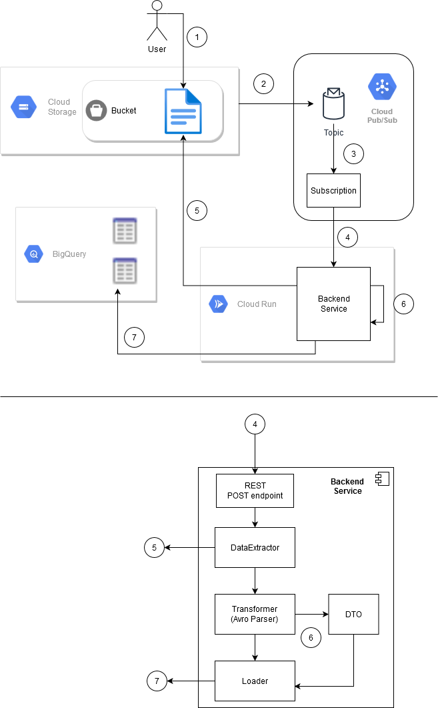

# GCP_Avro2BigQuery_ETL

Below is the scheme of a backend service running in Cloud Run. There is a data pipeline in GCP that uses
this service for automatic processing of Avro files with embedded schema that are being uploaded to a Cloud Storage
bucket. Whenever a new file is uploaded to the bucket, it is automatically processed by the backend service. This
service parses each file and writes the data from the file into two different tables in BigQuery. One table contains all the
fields from the files and another table contains only a subset of fields (only non-optional fields according to the Avro
schema).

## Data flow:

1. A User uploads an avro file to the bucket.
2. Notification OBJECT_FINALIZE event gets triggered and a message is published to the Topic on Cloud Pub/Sub
3. The notification propagates to the Subscription
4. The Subscription sends PUSH notification to the Backend Service, which is running in Cloud Run
5. The Backend Service loads the new file from the bucket
6. The Backend Service parses the file and transforms the data
7. The Backend Service loads the data into two tables in the BigQuery dataset

## The Backend Service Diagram

The Backend Service consists of the following components:

- REST Controller that processes POST push-notifications from the Pub/Sub Subscription. It gets the filename out of
the message and passes it to the DataExtractor
- The DataExtractor loads the avro file from the bucket storage and passes it to the Transformer
- The Transformer parses the avro file and extracts the data into a Data Transfer Object and passes it to the Loader
- The Loader uploads the data into two corresponding tables on the BigQuery

### Possible Exceptions:
- DataExtractor may not find the file (it might have been already deleted). In this case the processing stops, a message
with missing filename is logged.
- Transformer can’t read the file, because:
  - it is not an avro file
  - it is not compliant with the scheme
  In both cases the processing stops propagation and a message is logged (the reason and the filename)
- Loader fails to upload the data to either of the two tables. It may lead to inconsistency of the data in those tables.
  The message is logged (which table for which data failed). No rollback is performed.

### Possible improvements:
A Finalizer can be added to get control after the Loader and perform possible post processing actions such as deletion of
the original file from the bucket
